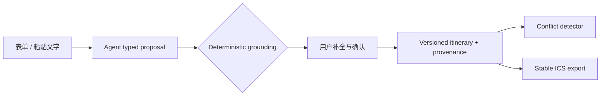
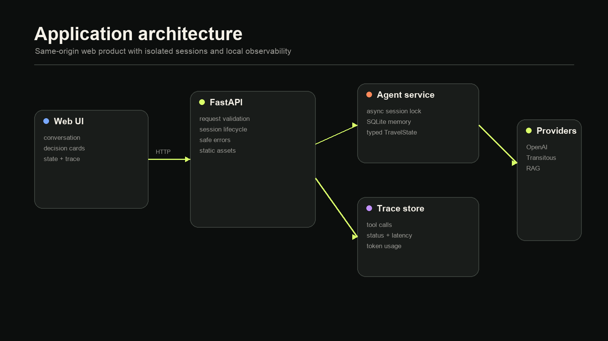
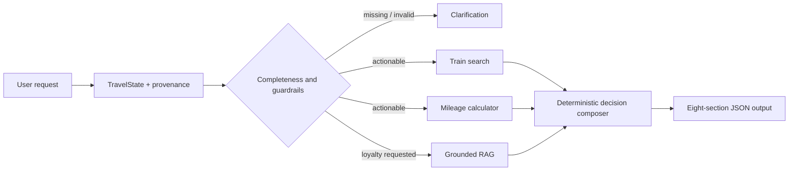
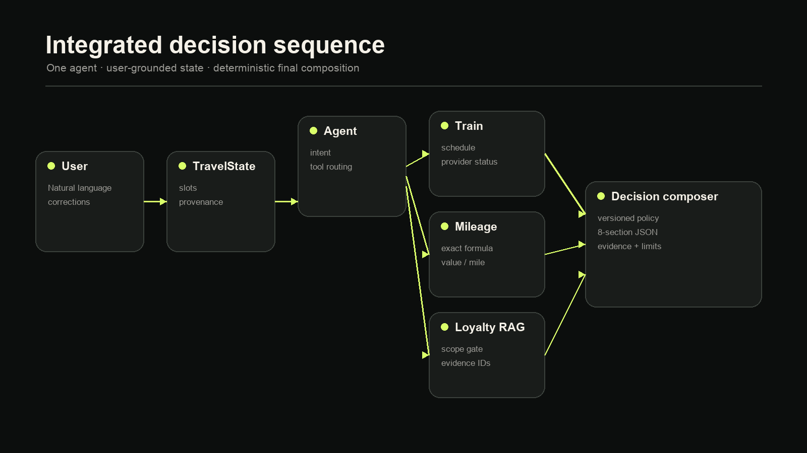

# TripFlow Travel Operations Agent

面向自由行用户的行程整理 Agent。用户可以粘贴中英文订单文字，也可以直接填写
表单；Agent 只生成待确认候选，确认后系统才会写入航班、火车和住宿行程，检查
时间重叠与换乘不足，最后导出带稳定 UID 的 ICS 日历。

火车不限定为 Eurostar：运营商是可追溯的自由文本字段，Deutsche Bahn、SNCF、ÖBB、
Renfe、中国铁路、JR 及其他运营商均可记录。截图/PDF 不是冷启动前提，当前主路径是
文字与表单。

## TripFlow workflow



### 可靠性边界

- Agent 没有修改行程的工具；候选解析 API 不会改变已确认 state。
- 确定性后处理删除无原文证据的运营商与时区，拒绝只有时分、没有日期的不完整时间。
- 每个确认字段保留 source type、source ID、原文摘要、确认状态和记录时间。
- 修改、删除使用 `If-Match` 乐观并发控制；过期页面不能静默覆盖新版本。
- 冲突检测、时区校验、持久化和 ICS 生成由应用代码负责，不交给模型推理。

v0.6 的跨境出行决策引擎仍保留在仓库中，作为复杂多轮 state / tool / RAG 可靠性的
对照实现；下文保留其设计与评测记录。



## Legacy decision workflow





依赖工具按顺序执行，避免并行调用竞争写入会话状态。用户修改现金价格时只使
里程计算与推荐失效；修改目的地时只重新查询铁路并重建推荐。第三方服务失败会
被记录为结构化状态，其他依赖继续执行，最终输出明确的 limitations。

## Reliability mechanisms

- Typed multi-turn state：业务状态与对话历史分离；支持参数补充、修改和任务切换。
- Parameter provenance：每个可执行参数记录用户原文、轮次和所属任务。
- Deterministic turn control：缺失参数、确认/否认、冲突与数据源越界在模型前处理，
  避免确认循环和无效 token/工具消耗。
- Dynamic tool gating：缺失、非法或无用户来源的参数不能授权工具调用。
- Tool input guardrails：拒绝模型替换城市、日期、票价、里程或税费。
- Grounded loyalty RAG：只基于返回证据作答，并保留 evidence ID 与官方 URL。
- Deterministic calculation and policy：计算与推荐阈值不交给模型心算。
- Structured final output：综合决策固定包含 request、transport、redemption、
  loyalty、recommendation、tradeoffs、evidence、limitations 八部分。
- Eval integrity：区分产品失败与基础设施失败，记录工具参数、输出、token、版本及哈希。
- Production observability：请求 ID、JSON 日志与 Prometheus 指标覆盖 HTTP、Agent、
  工具及 token，并避免记录消息正文和 session ID。

## Run locally

Requires Python 3.11+.

```bash
python -m venv .venv
source .venv/bin/activate
pip install -e '.[dev]'
```

复制 `.env.example` 为已忽略的 `.env.local`，填入 `OPENAI_API_KEY`。启动 Web 产品：

```bash
PORT=8000 python main.py
```

浏览器访问 `http://127.0.0.1:8000`，API 文档位于 `/docs`。旧版界面保留在 `/legacy`。
不设置 `PORT`
时保留原来的命令行交互模式：

```bash
python main.py
```

示例请求：

```text
2026-10-20 从伦敦去巴黎，现金票 400 英镑，奖励票 20,000 Avios
加 50 英镑税费，我是 BA Silver，应该怎么选？
```

## Verification

```bash
python -m pytest -q
python evals/run_tripflow_eval.py --validate-only
python evals/run_tripflow_eval.py
python evals/run_agent_eval.py --validate-only
python evals/run_agent_eval.py --category decision
python evals/run_agent_eval.py --all
```

当前确定性测试为 131/131。TripFlow 真实 Agent Eval 覆盖 90 个 case：扩展集
首轮 83/90，针对否定语义增加确定性闸门，并将有原文证据的运营商/产品线分栏
差异记录为有限等价值后，对同一批真实输出离线 regrade 为 90/90，基础设施失败为 0。
原 v0.6 最终
控制层的完整真实 Agent Eval 覆盖 100 个
case、136 个对话轮次，100/100 通过；工具路由、行为契约、structured state /
provenance 与输出契约四项指标均为 100%，基础设施失败经同版本断点重试后为 0。
其中综合决策专项为 10/10。详见 [评测报告](evals/REPORT.md)。本地单 worker、
SQLite session 生命周期压测在 200 次请求、并发 20 下为 200/200 成功，吞吐
161.66 ops/s，p95 252.41 ms；该结果不包含模型调用。

## HTTP contract

| Endpoint | Purpose |
|---|---|
| `GET /health` | 进程存活、版本、模型和凭据配置状态 |
| `GET /ready` | 检查 SQLite 与 API 凭据是否可用 |
| `GET /metrics` | Prometheus 格式的请求、Agent、工具与 token 指标 |
| `POST /api/sessions` | 创建隔离的会话状态与 SDK memory |
| `POST /api/chat` | 执行真实 Agent 路径并返回回答、state 与 trace |
| `GET /api/sessions/{id}` | 查看当前状态和最近 30 条请求 trace |
| `DELETE /api/sessions/{id}` | 清除会话 |

同一会话通过 async lock 串行执行，不同会话可以并发。SDK 对话历史、业务
structured state 与最近 30 条 trace 写入同一个 SQLite 文件的隔离表中，服务重启后
可以恢复；过期会话和对应消息会一并清理。模型/API 故障会返回 503 并回滚本轮
业务状态。公开 trace 包含工具参数、结构化状态、耗时和 token usage，但不包含
API key、用户完整消息或 system prompt。每个 HTTP 请求携带 `X-Request-ID`，
并输出不含消息正文的 JSON 日志。`/api/chat` 默认限制每 IP 每分钟 20 次请求。

## Container and CI

```bash
docker build -t travel-agent-v2 .
docker run --rm -p 8000:8000 \
  --env-file .env.local \
  -v travel-agent-data:/data \
  travel-agent-v2
```

容器以非 root 用户运行，named volume 保存 SQLite 数据。当前限流器是面向单 worker
部署的进程内保护；横向扩容时应替换为 Redis/API Gateway 限流。GitHub Actions 在
每次 push/PR 执行 131 项测试、两套 Eval 数据集静态校验、JavaScript/Python
语法检查和 Docker 构建；
CI 不读取线上密钥，也不会产生模型费用。

## Deploy to Render

默认 `render.yaml` Blueprint 使用 Render 免费 Web Service 部署到新加坡区域，
以 `/ready` 作为健康检查，并通过 secret 注入 `OPENAI_API_KEY`。免费实例休眠、
重启或重新部署后会丢失临时 SQLite 会话；`render.paid.yaml` 保留单实例加 1 GB
持久盘的生产形态。Render 免费计算不包含 OpenAI API 调用费用。完整操作、限制、
验证和回滚步骤见 [Deployment guide](docs/DEPLOYMENT.md)。

无需调用模型的并发验证：

```bash
python scripts/load_test.py --target session --requests 200 --concurrency 20
```

完整演示脚本与面试讲解见 [Demo guide](docs/DEMO.md)，架构取舍见
[Architecture](docs/ARCHITECTURE.md)，SLO、告警与故障处理见
[Operations](docs/OPERATIONS.md)，压测边界见 [Performance](docs/PERFORMANCE.md)，
安全与隐私边界见 [Security](docs/SECURITY.md)，部署手册见
[Deployment](docs/DEPLOYMENT.md)。

## Repository map

```text
agent.py / tools.py / state.py     Agent reliability core
tripflow_agent.py                  grounded typed proposal extraction
tripflow_models.py / service.py    versioned itinerary and provenance
tripflow_conflicts.py              deterministic timeline checks
tripflow_api.py / web/tripflow.*   REST contract and product UI
turn_controller.py                 deterministic turn-level control
decision_service.py                deterministic recommendation composer
agent_service.py                   persistent sessions, rollback and trace
app.py / api_models.py             FastAPI application contract
logging_config.py / rate_limit.py  request observability and API protection
metrics.py                         bounded Prometheus metrics
web/                               product UI
evals/                             100-case real-Agent evaluation suite
tests/                             deterministic unit and API tests
docs/                              prompt contract and generated PNG diagrams
.github/workflows/ci.yml           offline CI quality gate
Dockerfile                         non-root reproducible deployment image
compose.yaml                       persistent single-worker local deployment
render.yaml                        free Render portfolio Blueprint
render.paid.yaml                   paid persistent deployment reference
scripts/load_test.py               cost-gated concurrency benchmark
```

## Scope

本项目提供决策支持，不执行购票。铁路源当前只为受支持城市提供计划时刻且不含
票价；常旅客知识库是有边界的小型策展语料。推荐策略是可解释的产品规则，不代表
适用于所有用户的财务建议。
